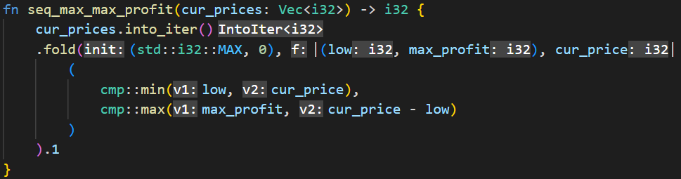

# Parallel version of Leetcode problem "Best Time to Buy and Sell Stock"
## The problem

The input of the problem is an array containing the prices of a stock over time. The goal is to find the maximum possible profit given these prices. This requires knowing when is the best time to buy and sell the stock.

### Example
*Input: [7,1,5,3,6,4]*,
*Output: 5*

Explanation: the stock can be bought for 1 and sold for 6, resulting in a profit of 5.

## Sequential algorithm:
Proposed solution:
> Go over each element, storing the minimum element found so far and updating the maximum profit so far whenever a new maximum is found. 
 
This guarantees that the lowest low (so far) is always "matched" with the highest possible value in the stock timeline.

Each element has to be checked exactly once to reach the solution with this algorithm. There is no point where it can be interrupted.

### Sequential implementation in Rust
The code seen in the image below (and included in this repository) shows the sequential implementation of the solution in Rust.

Fig. 1 - Sequential implementation of the solution in Rust

### Complexity of the sequential algorithm
As each element of the array is accessed only once, the complexity of the solution is polynomial 𝒪(n).

------------------
## Parallel algorithm:
The principle behind the parallel solution is the same as the sequential. The solution has to be adjusted to allow for parallel execution, however: 

This is achieved via continuously splitting the Vector in half and then joining the local results found by the algorithm.

*Note:  the vector is not manipulated in the implementation, the split happens by tracking the start and end indices for each subdivision as function parameters.*

For each split (left_vec, right_vec) in the vector, a struct containing (minElement, maxElement, maxLocalProfit) is returned. They can then be joined in a reduce fashion to obtain the full results:
- minElement = min(minLeftElement, minLeftElement)
- maxElement = max(maxLeftElement, maxLeftElement)
- maxProfit = max(maxLeftProfit, maxRightProfit, maxRightElement - minLeftElement)

### Implementation in Rust
For this problem, the joining operations are not associative, so I opted to use *join()* rather than *fold()* and *reduce()*, as the splitting done by *par_iter()* is non-deterministic and would require a slightly more complex implementation.

The code for the parallel implementation can be found in the function *par_max_profit* in the *main.rs* file. It can also be seen in the image below:

Fig. 2 - Parallel implementation of the solution in Rust

### Complexity
The complexity can be calculated following the master theorem.

At each level, the problem is split into *2 subproblems of size n/2*, with the subproblems being further subdivided in deeper levels. The cost of combining each subproblem's output is constant (just a comparison of max/min).

The relation is:
> T(n) = 2*T(n/2) + O(1)

In this case, the computation is leaf-heavy, with a = 2 and b = 2.
The complexity is then Θ(n ^ logb a) = O(n^1) = O(n). 

As we are taking multiple threads into account, the cost would be:
> C = Work / (#threads) + depth

Assuming 3 threads:
> C = N / 3 + log2 n 

---------------
# Results
## Testing
The parallel implementation was tested against the sequential implementation using randomly generated inputs of sizes [100_000, 1_000_000, 100_000_000].

## Numbers

The results of a few test runs with can be seen below:
| Input size  | Sequential execution | Parallel execution |
|-------------|----------------------|--------------------|
| 100_000     | 225.9µs              | 314.5µs            |
| 1_000_000   | 1.9193ms             | 1.9625ms           |
| 100_000_000 | 229.2672ms           | 177.6921ms         |

*Note: all runs were done using cargo run --release.*

The parallel implementation was consistently slower than the sequential one in the tests performed for small inputs. I assume this is related to the overhead of division and merging in the parallel function. However, with an input larger than 10 million prices, the parallel performance tends to be **better**.

## Parallel execution
  

Fig. 3 - Parallel execution diagram with input = 100k

---------------------
## Conclusion
As seen in the previous section, the parallel execution is beneficial over its sequential counterpart for large inputs.

To achieve these results, there were also some in-code optimizations to be taken into account:
### Performance improvements
The first big performance improvement done in the parallel implementation was to remove all usage of *clone()*. Passing just a reference of the vector instead of repetitively cloning showed a performance improvement of over 100x.

The second improvement was to limit the amount of levels created in the division. When the sub-vector's size is under 1000, the computation is performed sequentially in a helper method.
